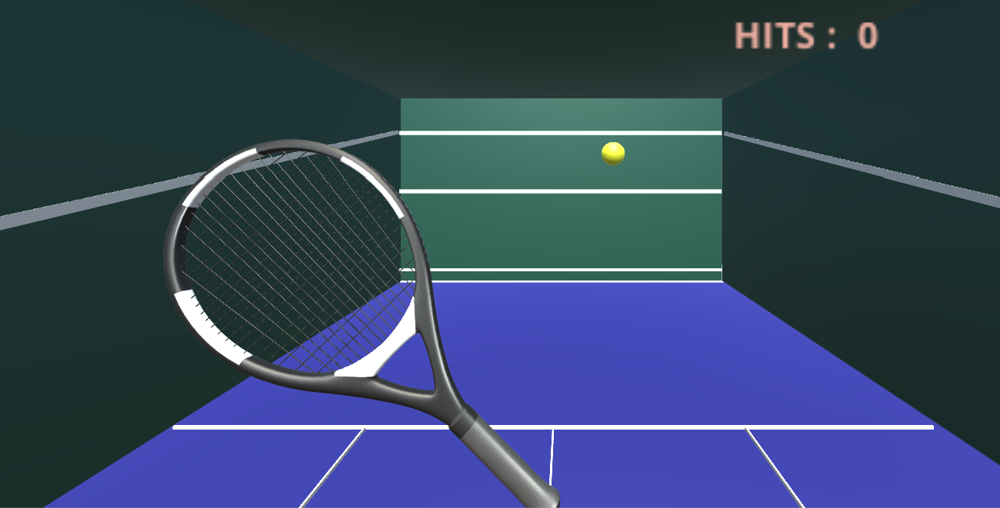

# Unity-Squash3D
My very first 3D game developed using Unity - simulates Squash practice. Have fun!

Developed using Unity v2018.3.12

Note : If you're new to Unity, I would definitely recommend spending some time looking at the Tutorials in the [Unity Learn section](https://learn.unity.com/tutorials). You probably have an idea for your game in your head already, but if you're not familiar with the basics you might end up making the development process a lot harder than it has to be (I'm guilty of this too!). Try out a few of their beginner projects until you're comfortable with the Editor and have a good idea of the functionality you want to include in your own game. 

## About

This game simulates a very simple PC-based Squash/Tennis Practice setup, with mouse control to move the racquet. A random ball shooter spawns balls every 2.5 seconds and you try hitting the ball with the racquet. If it goes back towards the front wall, that's a nice shot and worth 5 points! If you miss 10 balls, you lose.

Here's a screenshot from when the game was in development and I was testing out different colour themes :

## Installing and Building

To open this project in your Unity Editor, unzip the Assets folder and select the root folder to import into unity as a new project. It should create the libraries for you but that could take a while. Also, I've noticed some downward compatability issues with Unity before so try and make sure your version matches mine, or is even more recent. I've checked recently with v2019.1.8 and it worked just fine. 

To build, make sure you've added all the open scenes to the build settings first. Should build and run without any glitches.

If you have any suggestions, feedback or helpful advice - I'm all ears! Email me at nidhisalian08@gmail.com

To report bugs - Open an issue, I'll try and get back to you as soon as I can!

## License

[GNU General Public License](./LICENSE)
